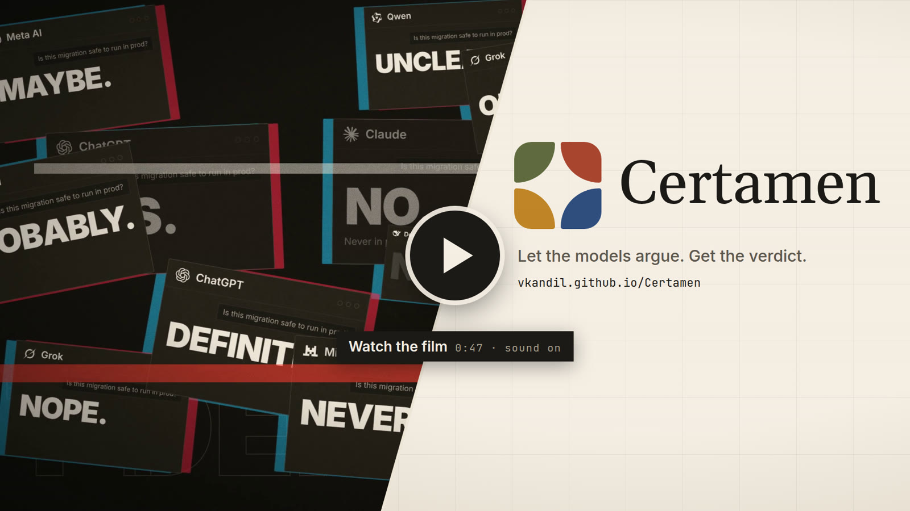
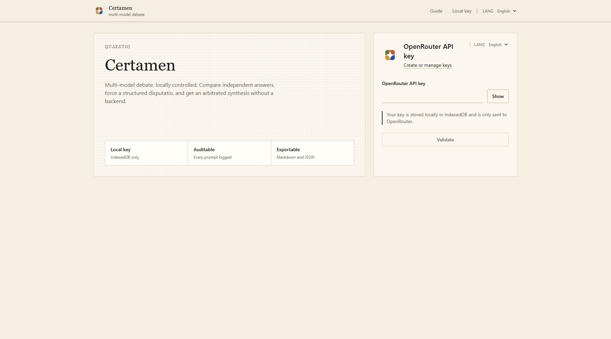
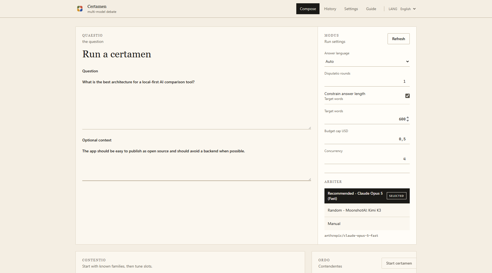
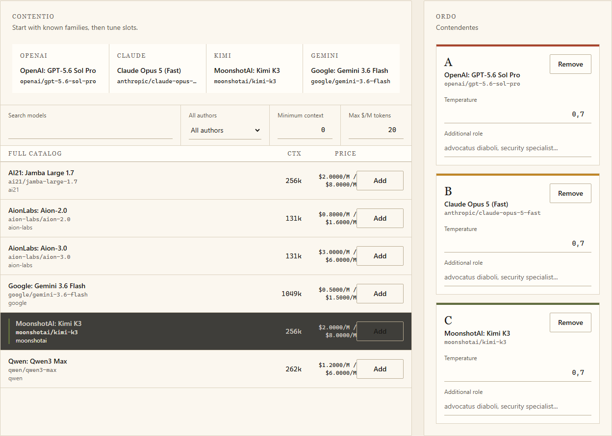

<div align="center">
  

  <h1>Certamen</h1>

  <p>
    <strong>Local-first multi-model debate.</strong><br />
    Ask one question, compare several LLMs, and get an arbitrated synthesis.
  </p>

  <p>
    <a href="#quick-start">Quick start</a>
    |
    <a href="#screenshots">Screenshots</a>
    |
    <a href="#features">Features</a>
    |
    <a href="PRIVACY.md">Privacy</a>
    |
    <a href="SECURITY.md">Security</a>
    |
    <a href="ROADMAP.md">Roadmap</a>
    |
    <a href="docs/GITHUB_PAGES.md">Deploy</a>
    |
    <a href="CONTRIBUTING.md">Contributing</a>
    |
    <a href="https://openrouter.ai/keys">OpenRouter keys</a>
  </p>

  <p>
    <a href="LICENSE"></a>
    <a href="PRIVACY.md"></a>
    <a href="PRIVACY.md"></a>
    <a href="https://openrouter.ai"></a>
    <a href="#security-notes"></a>
  </p>
</div>

<p align="center">
  <a href="https://github.com/user-attachments/assets/036586c6-b53a-4742-953f-2f36f5f5ea6b
">
    
  </a>
  <br />
  <sub><a href="https://github.com/user-attachments/assets/036586c6-b53a-4742-953f-2f36f5f5ea6b
"><b>▶ Watch the 47-second film</b></a> (sound on). Made entirely in code; see <a href="video/">video/</a>.</sub>
</p>

---

Certamen is a static web app for questions where one model is not enough. It runs several LLMs through OpenRouter, asks them to review anonymized peer answers, then uses an arbiter model to produce a final synthesis with consensus, dissensus, recommendations, and points to verify.

In Latin, **certamen** means a contest, debate, or trial of strength. Here, it is a structured contest between model answers.

There is no backend and no account system. The user brings an OpenRouter API key; Certamen stores it locally in the browser and only sends it to OpenRouter.

## Why Certamen?

Single-model answers are fast, but they hide disagreement. Certamen is built for questions where disagreement is useful: technical decisions, research synthesis, design review, risk analysis, strategy, and any topic where you want multiple independent attempts before a final recommendation.

Instead of asking one model to "think harder", Certamen runs a small structured protocol:

```text
question -> independent answers -> anonymized disputatio -> arbiter synthesis -> reveal/export
```

Each participant answers independently first. Then each model sees anonymized peer answers as data, not instructions, and revises its answer. Finally, an arbiter model produces a synthesis that highlights consensus, dissensus, recommendations, and points to verify.

## Screenshots

### Connect OpenRouter

Paste an OpenRouter key and start immediately. The key stays local in IndexedDB.



### Compose A Run

Write the question, add optional context, tune the number of disputatio rounds, choose the answer language, set a budget cap, and decide whether answers should target a specific length.

The arbiter can be recommended, random, or manually selected.



### Choose The Models

Start from recommended model families, then tune each slot. You can mix frontier models, fast models, cheaper models, and different providers. Certamen keeps the roster explicit so the final result is auditable.



## Features

- Local-first React app with no backend.
- OpenRouter model catalog loaded live, with the newest flagship of each lab suggested automatically (see [Choosing Models](#choosing-models)).
- Pick 2 to 6 debaters in one click (up to 8 from the catalog); presets follow the chosen size, one lab per slot.
- One-click rosters: best right now, fast and cheap, open weights, your usual models.
- Upgrade hints when a newer release of a model in your roster appears.
- Retry only the failed answers of a run, then re-run the arbiter.
- Multi-language UI and answer language selection.
- Per-model temperature and optional role/stance.
- Recommended, random, or manual arbiter selection.
- Streaming responses with OpenRouter SSE handling.
- Cost estimates before launch and real OpenRouter cost after calls.
- IndexedDB history for previous runs.
- Markdown, JSON, and permalink export.
- Prompt snapshots stored for auditability.
- Strict CSP and no external fonts or analytics.

## Choosing Models

New models ship every few weeks, so Certamen does not hard-code model ids. It reads the live OpenRouter catalog and decides from the data:

- **Release date** (`created` in the catalog): the newest release of a lab is usually the one people want to try.
- **Price tier**: within a lab, the priciest recent model is treated as its flagship. This separates "Opus" from "Haiku" without parsing names.
- **One lab per slot**: models from different labs disagree for real, which is the point of a debate. Anthropic, OpenAI, Google and xAI come first; within each tier, labs that shipped a flagship in the last 45 days move up.
- **No duplicates or non-debaters**: `:` variants (`:free`, `:batch`…), router aliases, safety classifiers (`*guard*`) and premium twins (`x-pro` / `x-fast` when plain `x` exists) are never suggested.
- **Your habits**: the models you run most often feed the "Your usual" preset. These counts stay in your browser.
- **Weekly overlay**: `public/featured-models.json` can pin or exclude models and reorder labs. The `Refresh featured models` workflow recomputes it every Monday and opens a pull request when the lineup changes. It only needs "Allow GitHub Actions to create and approve pull requests" in the repository settings.

The composer starts with the best lineup of the moment, shows why each model is there and what it should cost for your question, and offers three swaps per slot. The recommended arbiter is the strongest frontier model that is not already debating (for example Opus when Fable debates). The weekly pull request lists each lab's flagship under `snapshot.flagships`, so a wrong pick is easy to spot.

## Quick Start

```bash
npm install
npm run dev
```

The app opens at:

```text
http://localhost:5273
```

Create an OpenRouter key at https://openrouter.ai/keys, paste it into Certamen, and start a run.

## Hosted Demo

Certamen can be deployed as a static GitHub Pages app. The workflow is already included in `.github/workflows/deploy-pages.yml`.

See [docs/GITHUB_PAGES.md](docs/GITHUB_PAGES.md) for setup details.

## Privacy Model

Certamen is designed to be easy to inspect. See [PRIVACY.md](PRIVACY.md) for the full data-flow breakdown.

- the OpenRouter API key is stored in IndexedDB;
- the key is not stored in `localStorage`, cookies, URLs, Markdown exports, JSON exports, or permalinks;
- application network requests are limited by CSP to `self` and `https://openrouter.ai`;
- no telemetry, analytics, external fonts, or tracking pixels are loaded;
- model output is rendered through Markdown without raw HTML;
- Markdown links are sanitized before rendering;
- exports and permalinks redact OpenRouter-looking secrets.

Important limitation: because Certamen has no backend, your browser sends your key, question, context, and selected model prompts directly to OpenRouter. OpenRouter and the selected model providers receive the content required to run the debate.

Use a dedicated OpenRouter key with a spending cap.

## What Gets Stored Locally

Each run can store:

- the question and optional context;
- selected model ids and settings;
- your last roster and composer settings, and how often you used each model (for the "Your usual" preset);
- prompt snapshots;
- generated answers and parsed sections;
- status, costs, timestamps, and generation ids.

You can clear local data from the Settings page.

## Security Notes

Certamen includes guardrails, not magic:

- peer answers are escaped and anonymized before being sent to other models;
- peer answers are framed as data rather than instructions;
- raw HTML rendering is disabled;
- `dangerouslySetInnerHTML` is blocked by ESLint;
- tests cover secret redaction, permalink snapshot stripping, SSE parsing, prompt behavior, and Markdown link sanitization.

Prompt injection cannot be formally eliminated. Treat model output as untrusted text and verify important claims.

## Scripts

```bash
npm run dev        # start the local Vite server
npm run build      # typecheck and build static assets
npm run lint       # run ESLint
npm run test       # run unit tests
npm run e2e        # run Playwright onboarding test
```

## Project Structure

```text
src/api/       OpenRouter client, model catalog, SSE parsing
src/domain/    Certamen protocol, prompts, parsing, budget logic
src/store/     IndexedDB and Zustand stores
src/ui/        Screens, components, translations
src/export/    Markdown, JSON, permalink, redaction
tests/         Unit and Playwright tests
docs/          Protocol, design notes, screenshots
```

## Known Limits

- Exact reproducibility is not guaranteed, even when a model supports `seed`.
- Multi-agent debate can converge too early and lose a useful minority idea.
- Cost estimates are heuristics; final cost comes from OpenRouter usage data.
- OpenRouter model ids and pricing can change over time.
- Very long questions or rosters can exceed provider context limits.

## Roadmap

See [ROADMAP.md](ROADMAP.md) for the short release plan.

## Contributing

Contributions are welcome. Please keep changes small, tested, and aligned with the local-first privacy model.

Any change to `src/domain/prompts.ts` should increment `PROMPT_VERSION` and explain why the prompt changed.

## License

MIT


